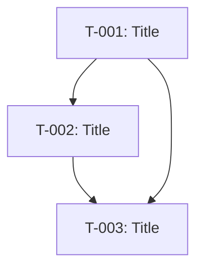

# Plan Template

Use this template when creating implementation plans.

**Output path:** `.opencode/memory/plans/YYYY-MM-DD-<feature>.md`

---

```markdown
# Implementation Plan: [Feature]

**Date:** YYYY-MM-DD
**Author:** [Name]
**Status:** Draft | Approved
**bead_id:** [ID]

---

## Overview

[Brief description of what will be built]

## References

- **Spec:** `.opencode/memory/specs/YYYY-MM-DD-descriptor.md`
- **PRD:** `.opencode/memory/prds/YYYY-MM-DD-feature.md` (if applicable)
- **Research:** `.opencode/memory/research/YYYY-MM-DD-topic.md` (if applicable)

---

## Tasks

### Task 1: [Title]

| Field | Value |
|-------|-------|
| **task_id** | T-001 |
| **type** | task \| bug \| feature \| chore |
| **assignee** | build \| fe \| be \| mobile \| devops |
| **effort** | S \| M \| L \| XL |
| **priority** | P0 \| P1 \| P2 |
| **status** | not_started \| in_progress \| blocked \| done |
| **dependencies** | [T-xxx] or none |

**Description:**
[What needs to be done]

**Input:**
- [Required artifacts/context]

**Output:**
- [Expected deliverables]
- [Files to create/modify]

**Acceptance Criteria:**
- [ ] AC-01: [Criteria]
- [ ] AC-02: [Criteria]

**Boundaries:**
- [What NOT to do]

---

### Task 2: [Title]

[Repeat structure]

---

## File Impact

**Files to CREATE:**
- `path/to/new-file.ts` — [Purpose]

**Files to MODIFY:**
- `path/to/existing.ts` — [Reason]

**Files to DELETE:**
- (none)

---

## Dependencies



---

## Effort Summary

| Task | Effort | Priority |
|------|--------|----------|
| T-001 | S | P0 |
| T-002 | M | P0 |
| T-003 | S | P1 |

**Total Estimated Effort:** [X days/weeks]

---

## Risk Assessment

| Risk | Probability | Impact | Mitigation |
|------|-------------|--------|------------|
| [Risk 1] | L/M/H | L/M/H | [Mitigation] |

---

## Quick Mode Eligibility

Tasks eligible for Quick Mode (no full plan needed):
- [ ] T-001 (S, ≤3 files, no security/db/api)

---

## Rollout Plan

| Phase | Tasks | Milestone |
|-------|-------|-----------|
| Phase 1 | T-001, T-002 | [Milestone] |
| Phase 2 | T-003 | [Milestone] |

---

## Approval

- [ ] Plan reviewed
- [ ] User approved
- [ ] Ready for implementation
```
